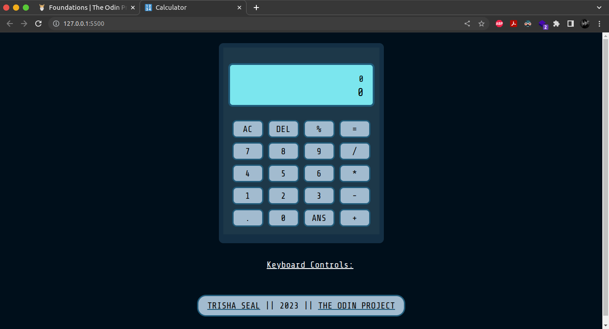

# Calculator

Table of Contents

1. [About The Project](#about-the-project) 
2. [Built With](#built-with)  
3. [Screenshots](#screenshots)  
3. [Contact](#contact)  
4. [Acknowledgements](#acknowledgements)

## About The Project

### Features:
- It can perform a variety of operations from basic to intermediate, for eg: addition, subtraction, multiplication, division, percentage. 
- Supports both integers and floating point numbers, with maximum input size of 16 digits.
- Supports keyboard controls. (Expand Keyboard Controls to know details about them.)
- Delete and All Clear Buttons to erase input.
- ANS button to use your last calculated result in current operation.

<a href="#top">Back to top</a>

### Built With

 

## Screenshots

<a href="#top">Back to top</a>

### Future Plans

- Adding other operations such as : factorial, trig calculators etc.
- Handling larger inputs.
- Handling negative number calculations.

## Contact

LinkedIn: [Trisha Seal](https://linkedin.com/in/trisha-seal)  
GitHub: [@EmberTSeal](https://github.com/EmberTSeal)

## Acknowledgements

Design and development by me, developed as part of The Odin Project, 2023.

<a href="#top">Back to top</a>

